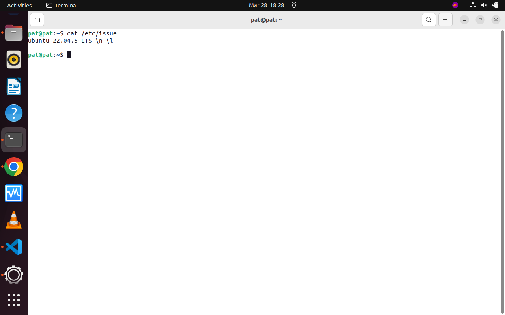
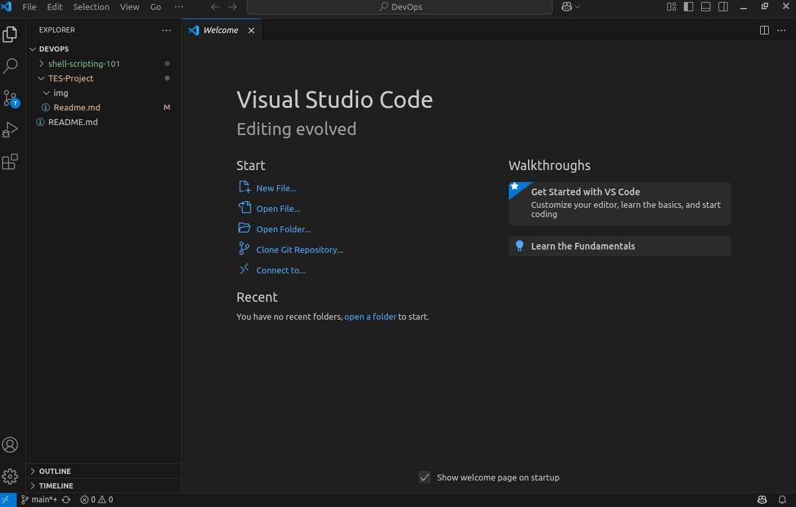
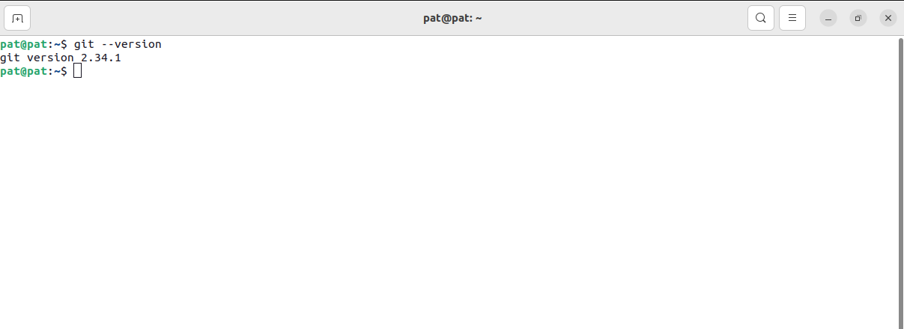
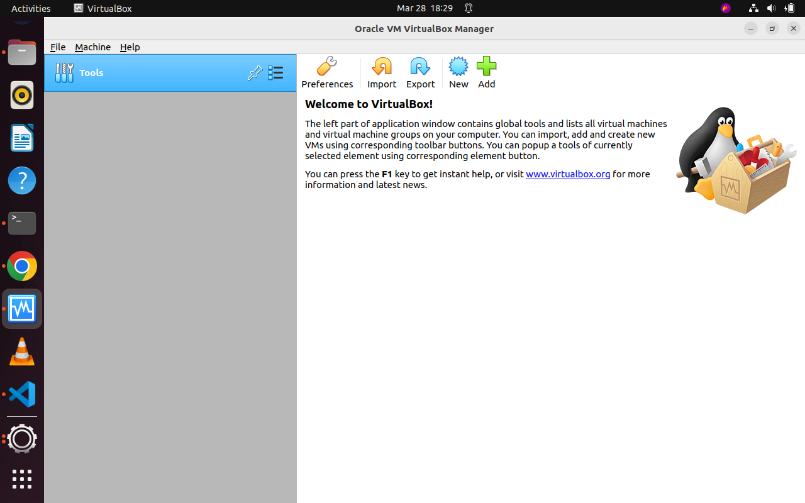
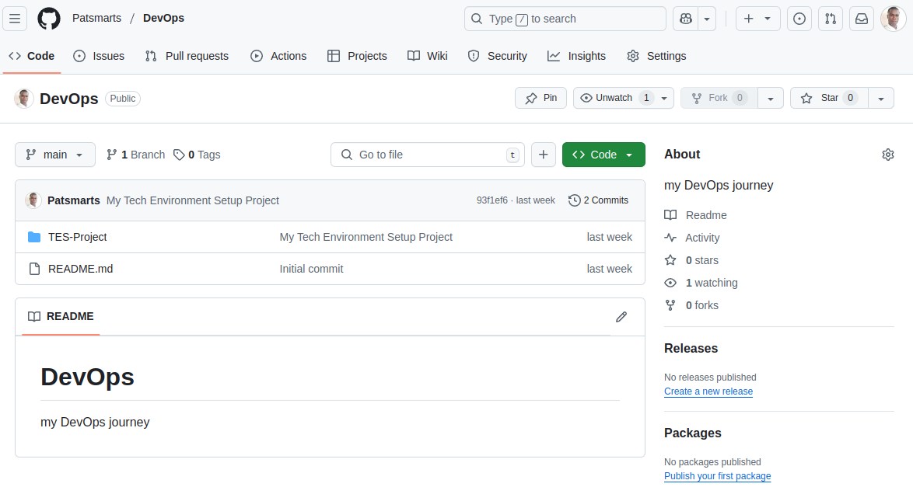
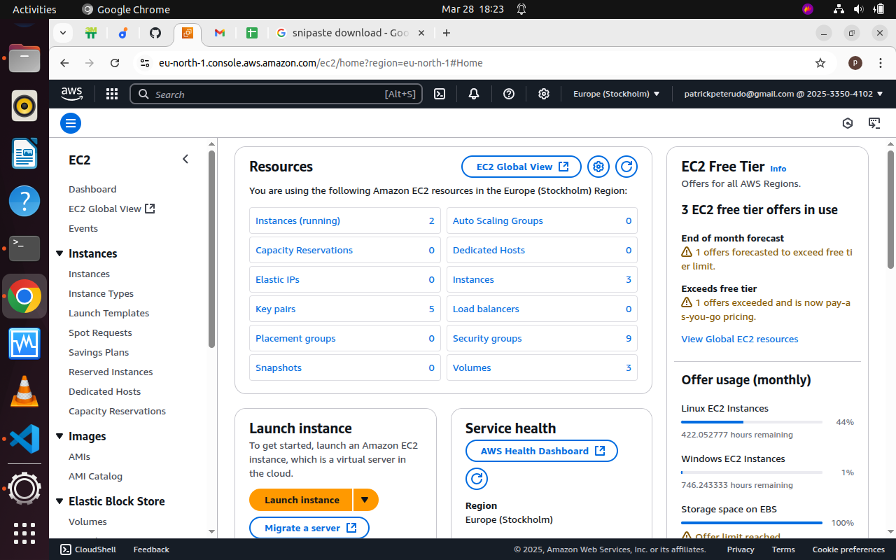

# Technical Environment Setup Project
# Patrick Peter

In this project I setup my technical environment needed for my DevOps journey.

PREREQUISITE REQUIREMENTS
1. I have internet connection to access cloud services, documentation, and online repository
2. I have functioning computer running Ubuntu OS with recommended specifications for adequate perfomance throughout the course. 

TOOLS REQUIREMENTS
1. VScode installed and functioning 
2. Git is installed 
3. Installed Virtual Box 

ACCOUNTS CREATED
1. Github 
2. Amazon Web Services (AWS) 

