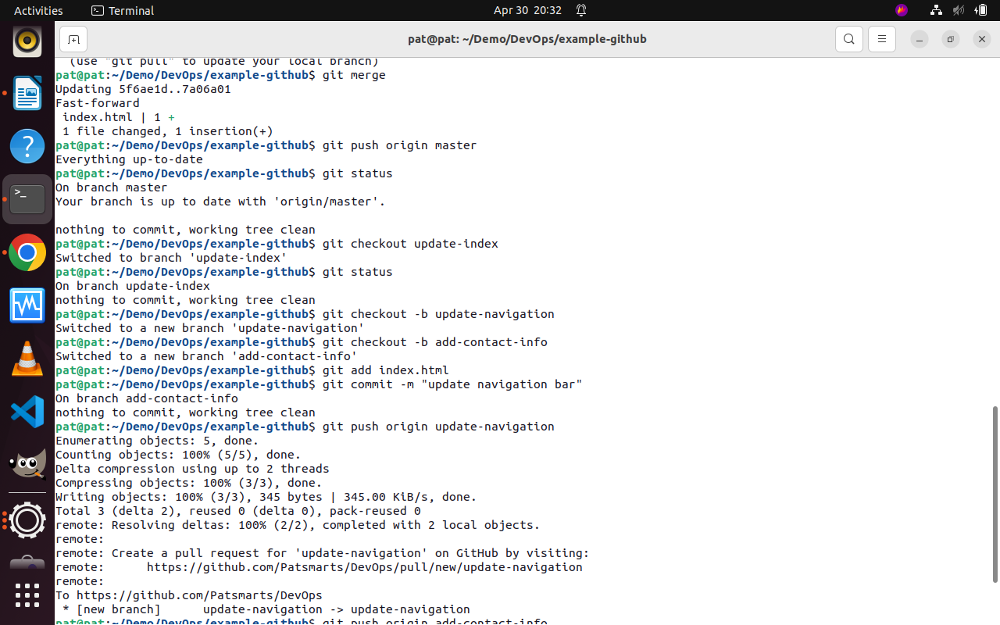
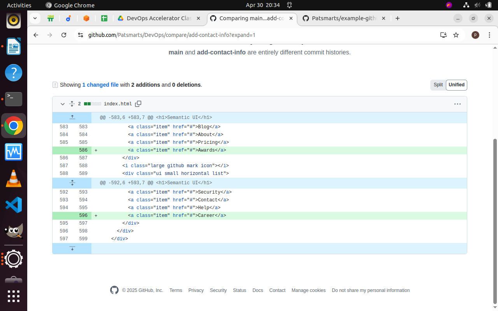

# Version Control System
My second mini project in module 1 of DevOps Learning track for 3MTT Cohort 3

# Mini Project 2
After cloning a project from a central repository-Github to my local environment, i created branches; update-navigation and add-contact-info. then pushed the branches to the central repository.
created a pull request for the branch.

# Screen Shot

1. ## Git Commands. 
2. 
   

   

   

    

    

    

    

    

## Github Actions

